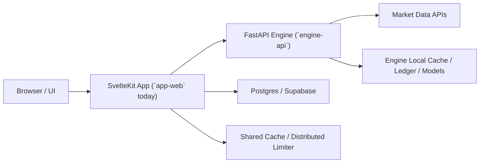
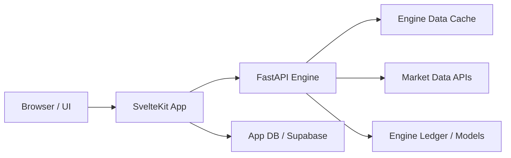
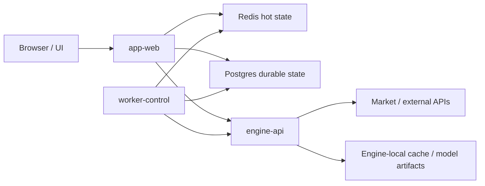
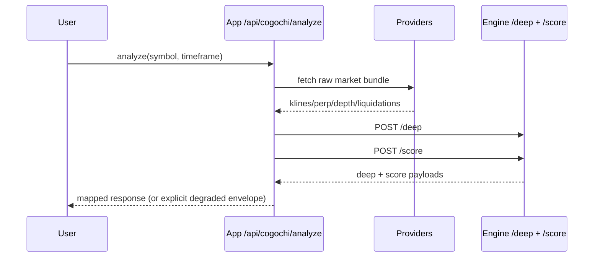

# System Architecture

This document defines the current verified structure and the target runtime design for multi-user operation.

## Current Verified Topology

## Context Diagram

## Ownership Map

- `app/`: UI surface and orchestration only
- `engine/`: canonical decision logic and scoring
- `docs/`: product/domain/decision truth and runbooks
- `research/`: hypotheses, eval protocol, experiment records

## Target Runtime Topology

### Runtime Roles

- `app-web`: public origin for UI, auth/session, public orchestration, SSE, and short-lived cached reads
- `engine-api`: canonical compute/runtime for deep analysis, scoring, evaluation, and engine-owned APIs; scheduler disabled in public Cloud Run deployments
- `worker-control`: internal-only scheduler, queue consumer, report generation, training trigger, and batch job runtime

### State Roles

- Redis: shared cache, distributed rate limit, ephemeral coordination, in-flight dedupe
- Postgres: durable user/domain state, outbox records, reports, jobs, audit-friendly persistence
- local fallback memory/files: development fallback only, not intended production truth

## Runtime Placement Policy

- public browser-facing routes run on `app-web`
- engine compute routes run on `engine-api`
- schedulers, training, report generation, and background fan-out move to `worker-control`
- public origins should not host long-running control-plane work by default

## Analyze Hot Path

## Analyze Runtime Notes

- `analyze` remains an app-orchestrated public route
- request-id, degraded mode, and cache status must be explicit in response headers/payloads
- short TTL shared cache is used to reduce duplicate fan-out on the public origin
- fallback responses bypass shared/public caching and return `no-store`

## Route Types

- proxy routes: pass-through only, no app-domain logic
- orchestrated routes: app assembles inputs and calls engine
- app-domain routes: engine not involved

## Reliability Notes

- degraded responses must set explicit degraded flags/reasons
- app never executes duplicated engine scoring logic
- contract updates must include both engine schema and app type sync
- public traffic, engine compute, and background jobs are different scaling and failure domains

## Migration Order

1. stabilize public hot paths on `app-web`
2. move scheduler/control-plane execution to `worker-control`
3. promote Redis-backed shared cache and distributed limiter as production defaults
4. classify remaining public routes by runtime plane and SLO
