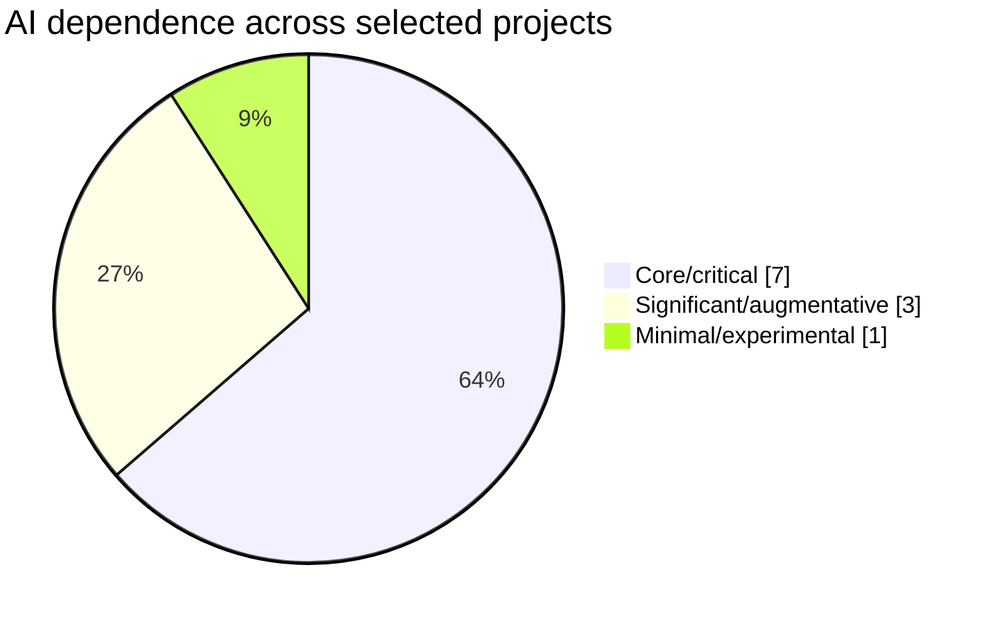
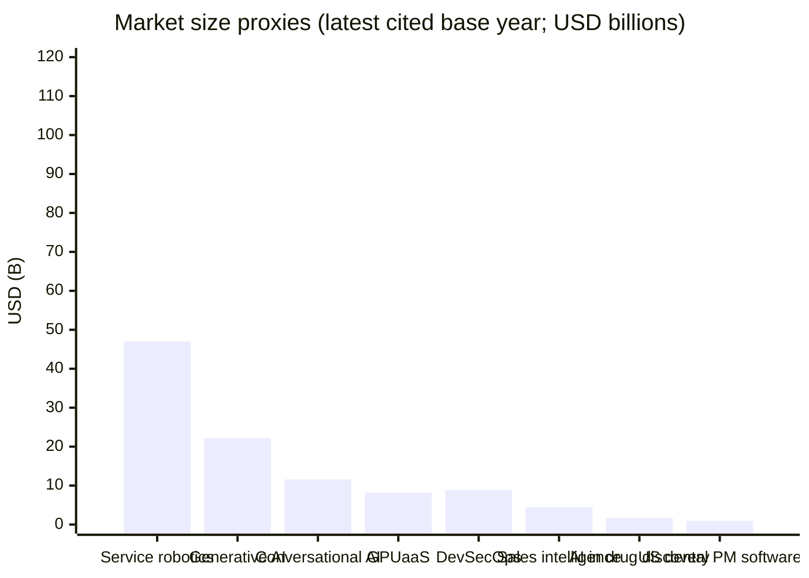

# YC and Corporate-Backed AI Projects Announced in Two Thousand Twenty-Five to Two Thousand Twenty-Six: A Market Analysis

## Executive summary

Across a curated set of eleven projects publicly associated with Y Combinator batches and/or corporate strategic investors, the dominant investment and product motif in the period is **“making AI agents workable in production”**: reliability (monitoring, evaluation), sandboxed execution, and infrastructure that turns frontier-model capabilities into operational software. Bluejay positions itself as a QA and observability layer for voice/text agents, using “digital humans” to simulate customer interactions pre-release. citeturn16view0turn14view0 Moda frames the core problem as silent agent failures (timeouts, tool-call errors, jailbreak attempts), and offers trace-centric monitoring, failure detection, and regression tracking. citeturn16view1turn12view4 Indexable’s ix.dev demonstrates a complementary infrastructure direction: “fork/snapshot any environment” with full state (databases/files/processes) and very low claimed snapshot latency, commoditizing the sandbox runtime that agent products increasingly require. citeturn19view0turn12view3

A second cluster is **vertical automation where AI agents directly replace labor in regulated workflows**. Toothy AI targets dental insurance and billing, asserting clinics spend substantial time on insurance tasks and describing a concrete, hybrid automation stack spanning X12 EDI parsing, Windows automation bots, and voice-agent calling (with references to telephony/voice tooling such as Twilio, Amazon Voice Connector, LiveKit, and VAPI as comparable integrations). citeturn13view0turn20view0turn20view1 Orange Slice applies agentic execution to sales intelligence/prospecting, describing a spreadsheet where “every column is TypeScript” that the system generates and executes (including web scraping and enrichment integration), and reporting subscription sales plus early YC customers. citeturn12view1turn27news10turn17view0

Corporate-backed rounds in this window concentrate on **infrastructure, trust, and “hard” deployment bottlenecks**: fal raised a Series C including Salesforce Ventures and Shopify Ventures and positions itself as a real-time generative-media inference layer with a serverless engine capable of running private/open/commercial models through one integration. citeturn5view0turn23search28turn23search1 NVIDIA’s ecosystem investment in Emerald AI highlights a non-obvious constraint—**power and grid interconnection**—with Emerald Conductor orchestrating AI workloads to reduce consumption during grid stress while maintaining service quality, including a cited Phoenix test achieving a 25% reduction on a 256‑GPU cluster. citeturn22view0turn5view1 Salesforce Ventures’ leadership in Code Metal emphasizes verifiable AI outputs (neuro-symbolic generation plus formal verification) as “mission-critical industries cannot deploy what they cannot verify.” citeturn7view0turn25view0turn26view0 Skild AI’s mega-round supports “Physical AI” via an “omni-bodied” robotics foundation model trained using human videos and physics simulations, and it claims rapid revenue ramp plus broad strategic investors (including Samsung, LG, and Salesforce Ventures). citeturn8view0

From a market-sizing perspective, the most capital-attracting projects map to the fastest-growing macro markets that sit “under” agent deployments: conversational AI (projected to grow substantially through the decade), generative AI, and GPU-as-a-service; while power constraints are becoming a gating factor as global data center electricity demand is projected to roughly double by the end of the decade in the IEA’s base case. citeturn9search1turn10search0turn11search0turn9search0

## Scope and method

This report focuses on **eleven projects** that meet both criteria: (a) publicly identified as YC companies in batches spanning Winter Twenty Twenty-Five through Winter/Spring Twenty Twenty-Six, and/or (b) publicly disclosed corporate venture/strategic participation in funding announcements during the target period. Core primary sources are YC Startup Directory pages and Launch YC posts (for product claims and founder identity), company documentation (for disclosed architecture/pricing), and press releases (for funding, traction, and partnerships). citeturn14view0turn16view0turn12view1turn5view0turn23search1turn8view0

A key constraint in technical and unit-economics analysis is that **most early-stage companies do not disclose** model names, parameter counts, training data provenance, or detailed inference cost/latency SLAs. Where such details are not explicitly stated in sources, the report marks them **“unspecified”** and, when useful, provides clearly labeled engineering inferences based on the described workflow (e.g., “voice AI implies ASR + TTS + LLM orchestration”). citeturn13view0turn20view0turn16view0

## Cross-project comparative analysis

### Comparative table of key attributes

| Project | YC batch or corporate backer and announcement date | Product and target customers | Business model and revenue streams | AI dependence | Market size proxy (latest disclosed in sources; not uniform year) | Traction signals (if available) |
|---|---|---|---|---|---|---|
| Bluejay | YC Spring Twenty Twenty-Five; seed round reported August Twenty Twenty-Five led by Floodgate (with YC, Peak XV, Homebrew participation) citeturn14view0turn28news22 | QA + monitoring for voice/text agents; simulates customer interactions and monitors production calls; targets teams building voice agents citeturn16view0turn14view0 | Unspecified (likely B2B SaaS / usage-based testing + monitoring; not explicitly priced in sources) citeturn16view0turn28news22 | **Core/critical** (product is simulation/eval/monitoring of AI agents) citeturn16view0 | Conversational AI market: USD 11.58B (estimated Twenty Twenty-Four) → USD 41.39B by Twenty Thirty citeturn9search1 | Seed funding USD 4M; investor syndicate disclosed citeturn28news22 |
| Toothy AI | YC Winter Twenty Twenty-Five; “grew 30x during W25,” “closed seed round” (date/amount unspecified) citeturn13view0turn20view0turn20view1 | Vertical AI agents for dental insurance verification, billing, claims; targets dental clinics citeturn13view0 | Unspecified (likely per‑clinic subscription + per-transaction/claim fees; not disclosed) citeturn13view0turn20view1 | **Core/critical** (explicitly “deliver through LLMs, AI voice”) citeturn20view1turn13view0 | US dental practice management software: USD 924.04M (estimated Twenty Twenty-Four) citeturn10search3 | “Grew 30x during the W25 batch”; targeting scale up to “140k dental clinics” (as market scope claim) citeturn20view0 |
| TensorPool | YC Winter Twenty Twenty-Five citeturn14view2turn16view2 | CLI that runs training jobs on GPUs; multi-cloud price optimization; targets ML teams who train/finetune models citeturn14view4turn14view2 | Usage-based compute margin (implied by “free compute” offer and cost-savings pitch); explicit pricing unspecified citeturn14view4turn16view2 | **Significant/augmentative** (core value is orchestration + cost optimization; AI use for “describe your job” is implied, not specified) citeturn14view2turn14view4 | GPU-as-a-Service: USD 8.21B (Twenty Twenty-Five) → USD 26.62B by Twenty Thirty citeturn11search0 | Early-user incentive: “$5/week of free compute” citeturn14view4 |
| Orange Slice | YC Summer Twenty Twenty-Five; seed funding USD 5.3M reported February Twenty Twenty-Six citeturn12view1turn27news10 | “Agentic sales enrichment spreadsheet” with AI-generated TypeScript columns and enrichments; targets B2B sales/revops teams citeturn12view1turn17view0 | Subscription (“sells subscriptions”) citeturn27news10 | **Core/critical** (agents execute research/enrichment; AI generates code/workflows) citeturn12view1turn17view0 | Sales intelligence market: USD 4.42B (Twenty Twenty-Five) → USD 9.15B by Twenty Thirty-One citeturn10search5 | Early customers include other YC startups (Novoflow, Pirros); seed investors disclosed citeturn27news10 |
| Indexable (ix.dev) | YC Spring Twenty Twenty-Six citeturn12view3turn19view0 | Sandbox infrastructure: full-environment forks/snapshots across files/processes/memory/DBs; targets agent builders needing reproducible runtimes citeturn12view3turn19view0 | Usage-based (“pay for what you use”; idle branches “cost almost nothing”) citeturn19view0 | **Minimal/experimental** (product is infra for agents; AI is used by customers’ agents, not intrinsic in disclosed core) citeturn19view0turn12view3 | AIOps proxy: USD 2.23B (Twenty Twenty-Five) → USD 11.8B by mid‑Thirties citeturn9search6 | Performance claims: snapshot/fork “in 26ms”; hardware scaling specs disclosed citeturn19view0 |
| Moda | YC Winter Twenty Twenty-Six citeturn12view4turn16view1 | Monitoring/reliability for AI agents using conversations + tool traces; targets agent teams in production citeturn16view1turn12view4 | Unspecified (likely B2B SaaS; not disclosed) citeturn16view1 | **Significant/augmentative** (focus on detecting hallucinations/injections/tool failures implies ML/LLM classifiers, but models not disclosed) citeturn16view1turn12view4 | AIOps proxy: USD 2.23B (Twenty Twenty-Five) citeturn9search6 | Traction unspecified citeturn16view1 |
| CellType | YC Winter Twenty Twenty-Six; claims core tech built with Google DeepMind and working with “Top 10 pharma” citeturn15view0turn15view2 | “Agentic drug company”: AI agents run discovery pipeline atop biological foundation models; targets pharma R&D citeturn15view0turn15view2 | Unspecified (likely pharma partnerships + milestone/licensing economics; not disclosed) citeturn15view0 | **Core/critical** (foundation models + agents are the product) citeturn15view0turn15view2 | AI in drug discovery: USD 1.71B (Twenty Twenty-Four) → USD 8.52B by Twenty Thirty citeturn9search3 | Traction claim: “working with Top 10 pharma”; validated “cancer treatment signal” citeturn15view0turn15view2 |
| fal | Series C announced July Thirty-One, Twenty Twenty-Five; new corporate investors include Salesforce Ventures and Shopify Ventures citeturn5view0turn23search28 | Real-time generative media inference platform (image/video/audio/3D) with serverless engine; targets developers + enterprises embedding gen media citeturn5view0turn23search1turn23search28 | Pay-per-use per model (Model APIs) + serverless runner-time billing; compute billed separately (docs) citeturn23search0turn23search12turn23search21 | **Core/critical** (business is serving and scaling AI model inference) citeturn5view0turn23search28 | Generative AI: USD 22.21B (Twenty Twenty-Five) → USD 324.68B by early Thirties citeturn10search0 | “1M+ developers,” “100+ enterprise customers,” “billions of AI-generated assets each month,” revenue “growing more than 50% in the last two months” citeturn5view0 |
| Emerald AI | Seed announced July Two, Twenty Twenty-Five; NVentures backing highlighted citeturn5view1turn22view0 | AI workload orchestration to make data centers flexible grid assets (reduce load during peak, shift workloads); targets data centers + grid operators citeturn22view0turn5view1 | Unspecified (likely enterprise SaaS + shared-savings / demand-response economics; not disclosed) citeturn22view0turn5view1 | **Significant/augmentative** (AI is central to runtime decisions, but value also depends on systems integration and optimization) citeturn22view0turn5view1 | Data center electricity demand projected to reach ~945 TWh by Twenty Thirty in IEA base case (energy TAM proxy) citeturn9search0 | $24.5M seed; Phoenix test: 25% power reduction for three hours on 256 GPUs while preserving quality citeturn5view1turn22view0 |
| Code Metal | Series B announced February Nineteen, Twenty Twenty-Six led by Salesforce Ventures; RTX among participants citeturn7view0turn25view0 | Verifiable code translation/optimization for mission-critical systems; targets defense, automotive, semiconductor, aerospace and other regulated environments citeturn7view0turn25view0turn26view0 | Unspecified (likely enterprise licensing + services; not disclosed) citeturn7view0turn26view0 | **Core/critical** (neuro-symbolic generation + formal verification is the differentiated product) citeturn25view0turn26view0 | DevSecOps proxy: USD 8.84B (Twenty Twenty-Four) → USD 20.24B by Twenty Thirty citeturn11search1 | Customer list includes Toshiba, RTX, L3Harris, US Air Force (disclosed) citeturn7view0turn25view2 |
| Skild AI | Growth round announced January Fourteen, Twenty Twenty-Six; NVentures participates; strategic investors include Samsung, LG, Salesforce Ventures citeturn8view0 | Robotics foundation model (“Skild Brain”) intended to control diverse robot morphologies; targets enterprise deployments initially citeturn8view0 | Revenue disclosed (not pricing): claims ~USD 30M revenue in “a few months” in Twenty Twenty-Five; monetization structure otherwise unspecified citeturn8view0 | **Core/critical** (foundation model is product and moat) citeturn8view0 | Service robotics: USD 46.99B (Twenty Twenty-Three) → USD 107.75B by Twenty Thirty citeturn10search6 | Raised ~USD 1.4B; valuation “over $14B”; training data sources (human videos + sim) disclosed; revenue claim disclosed citeturn8view0 |

### AI dependence distribution chart



(Classification is based on each company’s own product framing and technical disclosures, e.g., explicit agent/LLM dependence in Toothy AI and CellType, versus infra-first positioning in Indexable. citeturn20view1turn15view0turn19view0turn16view1)

### Market size comparison chart

The chart below uses **market proxies** (different base years) because uniform TAM/SAM/SOM disclosures are not available across all projects.



The values are drawn from service robotics (USD 46.99B in Twenty Twenty-Three, projected USD 107.75B by Twenty Thirty), generative AI (USD 22.21B in Twenty Twenty-Five), conversational AI (USD 11.58B in Twenty Twenty-Four), GPU-as-a-service (USD 8.21B in Twenty Twenty-Five), DevSecOps (USD 8.84B in Twenty Twenty-Four), sales intelligence (USD 4.42B in Twenty Twenty-Five), AI in drug discovery (USD 1.71B in Twenty Twenty-Four), and US dental practice management software (USD 0.924B in Twenty Twenty-Four). citeturn10search6turn10search0turn9search1turn11search0turn11search1turn10search5turn9search3turn10search3

### Common agentic reference architecture

```mermaid
flowchart LR
  U[User / Operator] --> P[Product UI / API]
  P --> O[Agent Orchestrator]
  O --> M[Model calls: LLM / Voice / Vision]
  O --> T[Tooling layer: APIs, RPA, browsers, EDI]
  O --> R[Retrieval layer: KB / vector search]
  R --> O
  T --> O
  O --> S[Sandbox runtime (fork/snapshot)]
  S --> O
  O --> V[Evaluation + monitoring / traces]
  V --> A[Alerts, regression, compliance reports]
  O --> OUT[Outputs: actions + artifacts]
```

This architecture pattern is explicitly reflected in Toothy AI’s disclosure of multi-stage NLP pipelines (EDI ↔ English), Windows RPA, voice calling, and observability tooling; in Moda’s “conversations and tool traces” monitoring; and in Indexable’s fork/snapshot sandbox primitives. citeturn20view0turn16view1turn19view0

## Project dossiers

### Bluejay

| Required element | Detailed analysis |
|---|---|
| Project name, founding team, YC batch or corporate investor, announcement date | **Bluejay**. Founders include **Rohan Vasishth** (CEO) and **Faraz Siddiqi** (CTO). YC **Spring Twenty Twenty-Five**. Seed funding **USD 4M** reported in late August Twenty Twenty-Five led by **Floodgate**, with participation from **Y Combinator**, **Peak XV**, and **Homebrew**. citeturn14view0turn28news22 |
| Product/service and target customers | “Quality Assurance for AI Voice Agents”: ultra-realistic simulations, evaluation, and production monitoring; creates “digital humans” with varied accents/languages/noise to stress test conversational turns; targets teams building voice agents. citeturn16view0turn28news22 |
| Business model and revenue streams | **Unspecified** in primary sources. Likely B2B SaaS with (a) pre-production simulation bundles and (b) ongoing production monitoring; however pricing is not disclosed. citeturn16view0 |
| Technical architecture and AI usage details | Discloses **synthetic customer simulation** with control over language/accent/noise/emotion, plus “research-backed evaluation” including latency/hallucination/tool calls/interruptions and “Skywatch” production observability. Specific underlying models (LLMs, ASR/TTS), hosting, training data, and costs are **unspecified**. citeturn16view0turn28news22 |
| Degree of AI dependence (with justification) | **Core/critical**: the product is itself AI-agent simulation + evaluation; without synthetic generation and agent analytics, the offering collapses. citeturn16view0 |
| Market size, competitors, GTM, pricing, regulatory/ethical risks | Market proxy: conversational AI projected to scale significantly through the decade. citeturn9search1 Competitors: Business Insider explicitly cites a competitive QA landscape including Braintrust, Arize AI, and Galileo (as examples). citeturn28news22 GTM: developer-led (Launch YC prompt includes “run a sanity check”), consistent with bottoms-up agent tooling adoption. citeturn16view0 Risks: handling customer call data implies privacy/security risks; evaluation systems may inadvertently store PII or sensitive call transcripts (compliance specifics **unspecified**). citeturn16view0 |
| Traction metrics | Seed financing disclosed; other operational metrics **unspecified**. citeturn28news22 |
| Scalability and unit economics assessment | Scalability hinges on simulation cost per test minute vs. willingness to pay for prevented incidents. Likely margin pressure from heavy voice simulation (ASR/TTS + LLM) if priced per-call without batching; mitigation strategies would include caching, scenario reuse, and cheaper model tiers (implementation **unspecified**). citeturn16view0 |
| Recommended strategic opportunities and risks | Opportunity: become “default QA harness” for voice agents via integrations into CI/CD and agent frameworks, turning evaluations into a defensible telemetry dataset (assuming consent). Risk: rapid commoditization if LLM observability incumbents extend into voice-specific evals, or if model providers ship native agent-eval toolchains. citeturn16view0turn28news22 |

### Toothy AI

| Required element | Detailed analysis |
|---|---|
| Project name, founding team, YC batch or corporate investor, announcement date | **Toothy AI**, YC **Winter Twenty Twenty-Five (W25)**. Founders listed in YC job post include **Johnny Chen**, **Matt Kerrigan**, and **Tejas Konduru**. citeturn13view0turn20view1 Seed round: “just closed our seed round” (amount/date **unspecified**). citeturn20view0 |
| Product/service and target customers | AI agents for dental practices to automate insurance-related workflows, including verification, billing, claims processing, and insurance phone calls using voice AI; targets dental clinics. citeturn13view0 |
| Business model and revenue streams | **Unspecified** in sources. Likely clinic subscription + add-on transaction pricing (claims/eligibility checks/calls), but not disclosed. citeturn13view0turn20view1 |
| Technical architecture and AI usage details | Unusually concrete disclosure: Python core infra; hybrid “on-prem/cloud” environments including “Windows bots” and “remote workstations”; multi-region networking and low-latency considerations; in-house screen-scraping/automation bots intended to scale; healthcare EDI integrations (X12 270/271, 837/277) and conversion of EDI into “LLM-readable format”; “multi-stage pipelines” converting structured EDI data to English and back; observability mention “LangFuse or similar”; voice calling agent pipeline with STT/TTS + LLM and IVR scripting/automation, listing example providers (VAPI, LiveKit, Amazon Voice Connector, Twilio, or comparable). citeturn20view0turn20view1turn13view0 Specific LLM names, fine-tuning details, training data, model sizes, and per-call inference cost are **unspecified**. citeturn20view1 |
| Degree of AI dependence (with justification) | **Core/critical**: the company explicitly states delivery “through LLMs” and “AI voice,” and the automation pipeline (EDI↔English, call agents) is AI-centered. citeturn20view1turn13view0 |
| Market size, competitors, GTM, pricing, regulatory/ethical risks | Market proxy: US dental practice management software estimated at **USD 924.04M** in Twenty Twenty-Four. citeturn10search3 GTM: targets scaling to “140k dental clinics” (claim), implying large US clinic count as immediate TAM framing. citeturn20view0 Regulatory: explicitly references HIPAA, SOC2/HITRUST, and MFA/jumphost security—strong signal of compliance-driven sales cycles and audit burden. citeturn20view0 Ethical risk: errors in insurance calls/claims could harm reimbursement timelines or introduce fraud concerns; mitigation mechanisms are **unspecified**. citeturn20view0 |
| Traction metrics | Claims “grew 30x during the W25 batch” and “closed seed round.” citeturn20view0 |
| Scalability and unit economics assessment | This is a “hybrid automation” business: unit economics depend on replacing human billing labor with a blend of RPA + LLM + voice minutes. Major COGS: (a) LLM inference for EDI translation and agent orchestration, (b) telephony + TTS/ASR minutes, (c) operational overhead of maintaining Windows/RPA bots across heterogeneous clinic environments. Toothy’s disclosed focus on multi-region networking, NAT traversal, and Windows automation indicates scaling complexity but also suggests strong moat if reliability is achieved. citeturn20view0turn20view1 |
| Recommended strategic opportunities and risks | Opportunity: expand from insurance workflows into broader clinic “back office” automation (billing, payments, eligibility, claims follow-up) as suggested by their mission to run the practice with “zero support staff.” citeturn20view0 Risk: heterogeneity of payer phone trees and clinic software may create long-tail maintenance costs; compliance failures (HIPAA) can be existential for enterprise adoption. citeturn20view0 |

### TensorPool

| Required element | Detailed analysis |
|---|---|
| Project name, founding team, YC batch or corporate investor, announcement date | **TensorPool**, YC **Winter Twenty Twenty-Five**. Founders: **Tycho Svoboda**, **Joshua Martinez**, **Hlumelo Notshe**. citeturn14view2turn16view2 |
| Product/service and target customers | “Vercel for GPUs”: CLI for ML training jobs (“describe your job”) and then GPU orchestration/execution “at half the cost of major cloud providers,” targeting teams that train or fine-tune models. citeturn14view2turn14view4 |
| Business model and revenue streams | Implied usage-based infrastructure revenue: offers “$5/week of free compute” to early users and positions itself on cost savings and orchestration. Explicit pricing and margin model are **unspecified**. citeturn14view4turn16view2 |
| Technical architecture and AI usage details | Explicitly claims: multi-cloud integration doing real-time analysis across GPU providers to choose cheapest; “spot node resummation tech” to combine spot pricing with reliability; avoids SSH/data migrations; deploys code to GPUs and ships results back; supports running multiple experiments via config files. citeturn14view4turn14view3 Their own internal AI usage (e.g., LLM parsing of “describe your job”) is **unspecified**. Training data/model sizes are not applicable unless they deploy orchestration ML (not disclosed). citeturn14view2 |
| Degree of AI dependence (with justification) | **Significant/augmentative**: the product serves AI builders and may use LLMs for UX, but disclosed differentiators are cloud scheduling and cost/availability optimization rather than proprietary models. citeturn14view4turn14view2 |
| Market size, competitors, GTM, pricing, regulatory/ethical risks | Market proxy: GPU-as-a-service expected to grow from USD 8.21B (Twenty Twenty-Five) toward USD 26.62B by Twenty Thirty. citeturn11search0 Competitive set: hyperscalers and GPU clouds (not exhaustively sourced here). Primary risks: reliability/availability in a GPU-constrained market; spot interruption exposure (they claim mitigation). citeturn14view4 |
| Traction metrics | Early user incentive disclosed; other traction **unspecified**. citeturn14view4 |
| Scalability and unit economics assessment | Infrastructure businesses scale with utilization and scheduling efficiency; margins depend on brokered compute spread (buying capacity vs charging users) and on minimizing scheduler overhead. TensorPool’s demonstrated emphasis on spot economics suggests potentially attractive gross margins if checkpoint/resume is robust, but exposure to GPU supply shocks and reliance on third-party clouds is material. citeturn14view4 |
| Recommended strategic opportunities and risks | Opportunity: differentiate with reproducible training environments, built-in cost forecasting, and compliance-ready audit trails for training runs (especially relevant as enterprise AI governance rises). Risk: platform risk if major clouds improve developer UX and integrate multi-cloud cost optimization, compressing TensorPool’s differentiation. citeturn14view4 |

### Orange Slice

| Required element | Detailed analysis |
|---|---|
| Project name, founding team, YC batch or corporate investor, announcement date | **Orange Slice**, YC **Summer Twenty Twenty-Five**. Founders: **Vihaar Nandigala** (CEO) and **Kishan Sripada** (CTO). Seed funding **USD 5.3M** reported February Twenty Twenty-Six; co-led by **1984 Ventures** and **Moxxie Ventures**, with **Paul Graham** participating. citeturn12view1turn27news10 |
| Product/service and target customers | “Agentic sales enrichment spreadsheet”: chat-driven prompts generate typed TypeScript “columns” that run enrichments (LinkedIn/contact/company data/web scraping/AI research) across rows; discovery of buying signals from web/news/social and niche sources (court records/building permits). Targets B2B teams doing outbound and sales engineering. citeturn12view1turn17view0 |
| Business model and revenue streams | Explicit: “sells subscriptions,” positioned for sales engineers and GTM teams. citeturn27news10 |
| Technical architecture and AI usage details | Discloses a “fully-typed SDK” with “100+ enrichments,” TypeScript execution in dependency order, and agent-driven research across sources. Underlying LLM/model provider(s), hosting, scraping infrastructure, and cost controls are **unspecified** in primary sources. citeturn12view1turn17view0 |
| Degree of AI dependence (with justification) | **Core/critical**: core UX is AI generating executable code and agents producing structured prospect intelligence from unstructured sources. citeturn12view1turn17view0 |
| Market size, competitors, GTM, pricing, regulatory/ethical risks | Market proxy: sales intelligence market expected to grow from ~USD 4.42B (Twenty Twenty-Five) to ~USD 9.15B by early Thirties. citeturn10search5 GTM: product framing is “Claude Code for GTM,” signaling developer-like adoption inside revenue teams (bottoms-up wedge). citeturn17view0 Risks: web scraping and enrichment implicates ToS enforcement, privacy rules, and data broker compliance; safeguards and data sourcing contracts are **unspecified**. citeturn12view1turn17view0 |
| Traction metrics | Reported early customers include YC startups (Novoflow, Pirros) and seed round details. citeturn27news10 |
| Scalability and unit economics assessment | Unit costs likely dominated by (a) enrichment API fees, (b) scraping infrastructure, and (c) LLM inference for research/code generation. Subscription pricing can be attractive if compute is amortized via caching and if high-intent “signals” reduce per-lead acquisition costs enough to justify seat pricing. The defensibility challenge is that enrichment APIs are commoditized; Orange Slice moat must come from orchestration, signal taxonomy, and workflow embedding in spreadsheets. citeturn12view1turn27news10 |
| Recommended strategic opportunities and risks | Opportunity: expand from enrichment to closed-loop GTM execution (handoffs to CRM, email sequencing, compliance checks) while keeping spreadsheet as the “interface.” Risk: data sourcing fragility and potential platform blocking; also, “agent in spreadsheet” may be replicated by incumbents if demand is proven. citeturn12view1turn17view0 |

### Indexable (ix.dev)

| Required element | Detailed analysis |
|---|---|
| Project name, founding team, YC batch or corporate investor, announcement date | **Indexable**, YC **Spring Twenty Twenty-Six**; founder **Andrew Gazelka**. citeturn12view3 |
| Product/service and target customers | Sandbox infrastructure for AI agents, emphasizing full-environment forks/snapshots across files/processes/memory/databases. Targets teams deploying coding agents or any agent requiring reproducible state. citeturn12view3turn19view0 |
| Business model and revenue streams | Explicitly usage-based: “pay for what you use”; idle branches cost “almost nothing”; storage deduplication; scaling specs disclosed. citeturn19view0 |
| Technical architecture and AI usage details | ix.dev claims: fork/snapshot any environment “in 26ms,” with full state including databases/files/processes; autoscale up to multi-terabyte RAM and very large storage; hardware spec includes EPYC Zen 5 CPUs and 25 Gbps networking; SDK model uses “branch/commit/diff” semantics and example shows running “codex exec” inside the fork. citeturn19view0 AI models are not part of core product; “Codex” appears as an example workload. On-prem vs cloud is implied as cloud-hosted, but explicit hosting details are **unspecified**. citeturn19view0 |
| Degree of AI dependence (with justification) | **Minimal/experimental**: the product is systems infrastructure; its value grows with agent adoption but does not require proprietary AI in the disclosed core. citeturn19view0turn12view3 |
| Market size, competitors, GTM, pricing, regulatory/ethical risks | Market proxy: AIOps market valued at USD 2.23B in Twenty Twenty-Five (directional proxy for “AI operations tooling”). citeturn9search6 Competitors: unspecified in primary sources; competitive set likely includes other sandbox/ephemeral environment providers and agent-runtime platforms. Pricing model is usage-based per infrastructure resources (details beyond “pay for what you use” are **unspecified**). citeturn19view0 Risks: secure isolation, secrets management, and tenant safety are existential; specific controls are **unspecified**. citeturn12view3 |
| Traction metrics | Unspecified. citeturn12view3 |
| Scalability and unit economics assessment | If snapshotting truly operates at very low latency and deduplicated storage, Indexable can benefit from strong infrastructure economies of scale; but unit economics are sensitive to cold-start overhead, peak memory footprints, and noisy-neighbor isolation. The most valuable wedge is becoming the “default agent runtime substrate” for enterprise agents that require deterministic reproduction for debugging. citeturn19view0turn12view3 |
| Recommended strategic opportunities and risks | Opportunity: bundle compliance and provable isolation (auditable snapshots, secrets escrow) for regulated enterprises deploying coding agents. Risk: infrastructure commoditization if cloud providers ship first-party sandbox runtimes tied to their agent SDKs. citeturn19view0 |

### Moda

| Required element | Detailed analysis |
|---|---|
| Project name, founding team, YC batch or corporate investor, announcement date | **Moda**, YC **Winter Twenty Twenty-Six**; founders **Pranav Bedi** and **Mohammed Al‑Rasheed**. citeturn12view4turn16view1 |
| Product/service and target customers | Monitoring and reliability for AI agents: tool-call error/timeout detection, “claimed it worked” runs, prompt injection detection, regression tracking, conversation segmentation, and trace-first drilldowns. Targets production agent teams. citeturn16view1turn12view4 |
| Business model and revenue streams | **Unspecified**. Likely B2B SaaS priced by traces/seats/agent volume; not disclosed. citeturn16view1 |
| Technical architecture and AI usage details | Explicitly operates on “conversations and tool traces” to produce actionable signals; highlights hallucination/frustration/injection attempts and regressions from prompt/harness changes. Model usage (LLM classifiers vs rules), hosting, training data, and latency/cost considerations are **unspecified**. citeturn16view1turn12view4 |
| Degree of AI dependence (with justification) | **Significant/augmentative**: product is agent analytics; many features could be partially rule-based, but the stated objective is learning patterns from usage at scale. citeturn12view4turn16view1 |
| Market size, competitors, GTM, pricing, regulatory/ethical risks | Market proxy: AIOps market (USD 2.23B in Twenty Twenty-Five) as an adjacent ops/automation spend category. citeturn9search6 Key risks are data leakage and handling of sensitive content in traces; prompt injection is explicitly cited as a failure mode. citeturn16view1 |
| Traction metrics | **Unspecified**. citeturn16view1 |
| Scalability and unit economics assessment | Monitoring products scale with log volumes; gross margins can be attractive if signal extraction is lightweight, but margins can compress if heavy LLM-based labeling is run on all traffic. A likely scalable path is tiered sampling plus on-demand deep analysis, but implementation is **unspecified**. citeturn16view1 |
| Recommended strategic opportunities and risks | Opportunity: become the “Datadog/Sentry for agents” by standardizing agent trace schemas (including MCP/tool traces) and bundling safety/compliance analytics. Risk: observability incumbents and model providers may integrate native agent tracing and evaluation, reducing standalone value. citeturn16view1 |

### CellType

| Required element | Detailed analysis |
|---|---|
| Project name, founding team, YC batch or corporate investor, announcement date | **CellType**, YC **Winter Twenty Twenty-Six**. Founders **David van Dijk** (CEO) and **Ivan Vrkic**. Claims its core technology was developed with **Google DeepMind**. citeturn15view0turn15view1 |
| Product/service and target customers | “Agentic drug company”: AI agents run full drug discovery pipeline on top of biological foundation models that simulate human biology; targets pharma, with claim of working with “Top 10 pharma.” citeturn15view0turn15view2 |
| Business model and revenue streams | **Unspecified** (common models: platform partnerships, milestone payments, licensing, co-development). citeturn15view0 |
| Technical architecture and AI usage details | Discloses “Cell2Sentence” as core technology (ICML paper and bioRxiv “C2S-Scale” referenced) and claims it “teaches LLMs to understand cellular biology,” using single-cell biology representations. citeturn15view2 Model sizes, training datasets, compute stack, and inference costs are **unspecified** in YC page content. citeturn15view2 |
| Degree of AI dependence (with justification) | **Core/critical**: foundational biological models + autonomous agents are framed as the company’s entire approach. citeturn15view0turn15view2 |
| Market size, competitors, GTM, pricing, regulatory/ethical risks | Market proxy: AI in drug discovery valued at USD 1.71B in Twenty Twenty-Four, projected to USD 8.52B by Twenty Thirty. citeturn9search3 Competitive set (examples from market report): Atomwise, BenevolentAI, Insilico Medicine, Recursion, and major cloud/AI vendors active in the category. citeturn9search3 Regulatory: drug discovery outputs ultimately face clinical and regulatory validation; ethical risks include bias in biomedical datasets and overclaiming model generalization (specific mitigations **unspecified**). citeturn15view2 |
| Traction metrics | Claims: discovered and validated a new cancer treatment signal and is working with “Top 10 pharma.” citeturn15view0turn15view2 |
| Scalability and unit economics assessment | Techbio economics are asymmetric: compute is a meaningful cost, but even modest probability improvements in target selection can justify high pricing due to pharma R&D scale. The key unit-economics question is how quickly CellType can translate model predictions into validated wet-lab results and durable partnerships; details of validation throughput are **unspecified**. citeturn15view2 |
| Recommended strategic opportunities and risks | Opportunity: use agentic automation to compress discovery cycle-time and build defensible proprietary datasets (single-cell + perturbation) that improve model performance over time. Risk: scientific reproducibility and “simulation-to-reality” gaps; competitors with larger proprietary datasets may outpace. citeturn15view2turn9search3 |

### fal

| Required element | Detailed analysis |
|---|---|
| Project name, founding team, YC batch or corporate investor, announcement date | **fal** (generative media inference platform). Series C announced **July Thirty-One, Twenty Twenty-Five**, led by Meritech with new investments from **Salesforce Ventures** and **Shopify Ventures** (also mentions Google AI Futures Fund joining). citeturn5view0 Founder/CEO cited in press release: **Burkay Gur**. citeturn5view0 |
| Product/service and target customers | Infrastructure platform for real-time generative media across image/video/audio/3D; “proprietary, serverless engine” that lets customers run “any AI model” (private/open/commercial) via one integration; targets developers and enterprises embedding generative media. citeturn5view0turn23search1turn23search28 |
| Business model and revenue streams | Documented: per-model pay-per-use pricing (e.g., per image/video/second/request) for Model APIs; Serverless billing per-second based on runner lifetime; Compute billed per-hour on dedicated instances. citeturn23search0turn23search12turn23search21 |
| Technical architecture and AI usage details | fal Serverless: deploy custom models/pipelines as Python classes onto GPU infrastructure that autos-scales from zero to thousands; supports selecting machine types (H100/A100 etc) and provides queue-based reliability and analytics. citeturn23search1turn23search28 Press release emphasizes “zero DevOps overhead” and global performance. citeturn5view0 Model catalog includes multimodal generation; specific third-party model providers vary per endpoint, and training data/model sizes belong to the models themselves (often third-party) and are generally **unspecified** at platform level. citeturn23search28 |
| Degree of AI dependence (with justification) | **Core/critical**: the platform’s value proposition is optimized AI inference and scaling for generative models. citeturn5view0turn23search28 |
| Market size, competitors, GTM, pricing, regulatory/ethical risks | Market proxy: generative AI market estimated at USD 22.21B in Twenty Twenty-Five. citeturn10search0 Competitive set (examples cited in a third-party tool directory’s alternatives list): Replicate, Modal, RunPod, Hugging Face Inference Endpoints (non-exhaustive). citeturn23search15 Regulatory/ethical: generative media raises copyright, deepfake, and provenance issues; enterprise needs content controls (platform-specific safeguards **unspecified**). citeturn5view0 |
| Traction metrics | Press release claims: “more than 1 million developers,” “100+ enterprise customers,” named enterprise customers, “billions of AI-generated assets each month,” and “revenue growing more than 50% in the last two months.” citeturn5view0 |
| Scalability and unit economics assessment | fal’s documented billing aligns revenue to GPU time/output units, enabling direct contribution margin management. The main scaling risks are GPU supply and inference efficiency; their “queue-based” architecture and scaling-to-zero model suggest strong unit economics if utilization is managed. citeturn23search12turn23search28 |
| Recommended strategic opportunities and risks | Opportunity: become default “model router” and inference substrate across enterprises embedding generative media, especially if they can provide governance/provenance tooling. Risk: hyperscaler competition and pricing pressure; also model commoditization could shift value from infra to application layer. citeturn5view0turn23search28 |

### Emerald AI

| Required element | Detailed analysis |
|---|---|
| Project name, founding team, YC batch or corporate investor, announcement date | **Emerald AI** (not a YC project in the cited sources here). Seed funding disclosed **early July Twenty Twenty-Five** (~$24–24.5M) with backing from **NVentures**; Radical Ventures led per DCD; NVIDIA blog also states “more than $24M.” citeturn5view1turn22view0 Founder/CEO: **Varun Sivaram** (disclosed). citeturn22view0turn5view1 |
| Product/service and target customers | Emerald Conductor: “AI-powered system” mediating between grid and data center; orchestrates workloads across data centers, pausing/slowing flexible jobs and rerouting critical inference to other sites; targets AI factories/data centers and grid operators. citeturn22view0turn5view1 |
| Business model and revenue streams | **Unspecified**. Likely enterprise software + integration fees, plus potential shared savings from demand-response/peak-shaving; not disclosed. citeturn22view0 |
| Technical architecture and AI usage details | NVIDIA blog provides concrete trial details: field test in Phoenix reduced power consumption of AI workloads on **256 NVIDIA GPUs** by **25% for three hours** while preserving compute service quality; trial in Oracle Cloud Phoenix region with GPUs across a multi-rack cluster “managed through Databricks MosaicML”; Emerald Simulator models system behavior; agents can automatically predict workload flexibility; cluster ramped down over 15 minutes during a grid stress event. citeturn22view0 Model types (RL vs optimization vs ML predictors), training data, and model sizes are **unspecified**. citeturn22view0 |
| Degree of AI dependence (with justification) | **Significant/augmentative**: the company positions the orchestration as “AI-powered” and uses agents/simulation, but success depends equally on systems integration, telemetry, and control-plane reliability. citeturn22view0turn5view1 |
| Market size, competitors, GTM, pricing, regulatory/ethical risks | Macro driver: IEA projects global data center electricity consumption roughly doubling to ~945 TWh by Twenty Thirty in base case, underscoring the urgency of grid-flexibility solutions. citeturn9search0turn22view0 Regulatory: energy and utility coordination plus new laws can mandate load shed (NVIDIA blog cites Texas passing a law requiring ramp down/disconnect during load shed events). citeturn22view0 Ethical/systemic: risk of shifting compute away from certain regions (equity), and reliability obligations to customers during curtailment (mitigation via SLAs is **unspecified**). citeturn22view0 |
| Traction metrics | Funding disclosed; demonstration results disclosed; other commercial deployment metrics are **unspecified**. citeturn5view1turn22view0 |
| Scalability and unit economics assessment | If Emerald can monetize a fraction of avoided capex (faster interconnect, deferred infrastructure) and energy cost savings, unit economics can be strong with relatively small deployment footprints (software control plane). However, each deployment is integration-heavy (telemetry/control loops across heterogeneous workloads), which can constrain scale unless productized connectors standardize the stack. citeturn22view0 |
| Recommended strategic opportunities and risks | Opportunity: partner tightly with cloud providers (already includes Oracle/Databricks collaboration) and utilities to standardize workload-tier labeling and create a market mechanism for “flexible compute.” citeturn22view0 Risk: grid regulation variability and potential pushback if AI data centers are perceived as driving consumer rate increases; failure during curtailment could create reputational damage. citeturn22view0turn5view1 |

### Code Metal

| Required element | Detailed analysis |
|---|---|
| Project name, founding team, YC batch or corporate investor, announcement date | **Code Metal**. Series B announced **February Nineteen, Twenty Twenty-Six**, led by **Salesforce Ventures**; participants include **RTX** and others; valuation cited as $1.25B in Business Wire release. citeturn7view0 Founder/CEO: **Peter Morales**. citeturn7view0turn25view0 |
| Product/service and target customers | “Verifiable code translation” for mission-critical industries; breaks programs into symbolic components and aims to “mathematically prove” generated code correctness (Salesforce Ventures framing). Code Metal product page describes translating high-level reference code (Python/Matlab/Julia) into low-level deployable code across CPUs/GPUs/FPGAs with toolchains. Targets defense/automotive/semiconductor/aerospace. citeturn25view0turn26view0turn7view0 |
| Business model and revenue streams | **Unspecified**; likely enterprise licensing + integration. citeturn25view2turn7view0 |
| Technical architecture and AI usage details | Discloses a “neuro-symbolic platform” marrying generative AI with formal verification; product flow: ingest code, auto-track dependencies and plan transpilation; define runtime (CPU architecture + accelerators like NVIDIA/AMD/Qualcomm GPUs, FPGAs like Xilinx/Altera) and toolchains (examples include ONNX and Vivado); generate embedded C/C++/Rust, VHDL/Verilog, CUDA/HIP/ONNX variants optimized for memory/runtime/power; track diffs back to input code. citeturn25view0turn26view0turn25view2 Specific LLMs, solver stacks, proof systems, training data, and inference costs/latency are **unspecified**. citeturn25view0turn26view0 |
| Degree of AI dependence (with justification) | **Core/critical**: differentiator is explicitly neuro-symbolic AI + verification; without generative translation and formal proof layer, product reduces to conventional tooling. citeturn25view0turn26view0 |
| Market size, competitors, GTM, pricing, regulatory/ethical risks | Proxy: DevSecOps market estimated USD 8.84B in Twenty Twenty-Four (growing to USD 20.24B by Twenty Thirty). citeturn11search1 GTM: enterprise/defense contracting—press release highlights customers in defense and regulated industries. citeturn7view0turn25view2 Regulatory: defense customers imply export controls, secure development environments, and long procurement cycles (details **unspecified**). citeturn7view0 |
| Traction metrics | Disclosed customers: Toshiba, RTX, L3Harris, and US Air Force; Salesforce Ventures also claims customer wins in first year. citeturn7view0turn25view0turn25view2 |
| Scalability and unit economics assessment | Enterprise platform economics can be attractive via high ACVs; bottleneck is deployment and validation integration into customer toolchains. If Code Metal’s verification genuinely reduces certification friction (e.g., safety-critical proof obligations), switching costs can be high. Risks include lengthy sales cycles and the engineering burden of supporting many target architectures and toolchains. citeturn26view0turn25view0 |
| Recommended strategic opportunities and risks | Opportunity: position as “default verified transpilation layer” for the migration from CPU-centric to heterogeneous edge systems, leveraging formal proof as moat. Risk: if proof obligations remain bespoke per customer and cannot be standardized, professional services could dominate and restrict margins. citeturn25view0turn26view0 |

### Skild AI

| Required element | Detailed analysis |
|---|---|
| Project name, founding team, YC batch or corporate investor, announcement date | **Skild AI**. Funding announced **January Fourteen, Twenty Twenty-Six**: close to **$1.4B** led by SoftBank with participation from **NVentures**; strategic investors include **Samsung**, **LG**, and **Salesforce Ventures**; valuation “over $14B.” citeturn8view0 Founders: CEO **Deepak Pathak** and President **Abhinav Gupta** (both cited). citeturn8view0 |
| Product/service and target customers | “Skild Brain”: unified, “omni-bodied” robotics foundation model intended to control diverse robot bodies without prior body knowledge; enterprise deployments first (security, delivery, warehouses, manufacturing, data centers, construction), with long-term goal of home deployment. citeturn8view0 |
| Business model and revenue streams | Revenue claim: grew “from zero to about $30M revenue in just a few months in 2025.” Monetization mechanics (licensing per robot, SaaS, services, revenue share) are **unspecified**. citeturn8view0 |
| Technical architecture and AI usage details | Training approach: lacks “internet of robotics,” so the company pre-trains by “watching human videos” and practicing in “physics-based simulations.” Claims in-context learning allows adaptation to new bodies/environments without retraining/fine-tuning, with ability to handle failures like loss of limbs/jammed wheels. citeturn8view0 Model family/type (transformer policy, diffusion policy, RL stack), parameter count, inference latency/cost, and on-robot vs cloud inference split are **unspecified**. citeturn8view0 |
| Degree of AI dependence (with justification) | **Core/critical**: the foundation model is explicitly the product and scaling focus; data flywheel thesis depends on deployment improving model. citeturn8view0 |
| Market size, competitors, GTM, pricing, regulatory/ethical risks | Market proxy: service robotics market estimated USD 46.99B in Twenty Twenty-Three, projected USD 107.75B by Twenty Thirty. citeturn10search6 GTM: enterprise first, broad deployment verticals, then consumer homes. citeturn8view0 Regulatory/ethical: physical safety, liability, and labor displacement risks; constraints and safety assurance details are **unspecified**. citeturn8view0 |
| Traction metrics | Funding size, valuation, revenue claim, deployment verticals disclosed; more granular metrics (robots deployed, retention) are **unspecified**. citeturn8view0 |
| Scalability and unit economics assessment | Skild’s economics depend on (a) cost to train/serve the model and (b) monetization per deployment. If “data flywheel” works, marginal model improvement per deployment can create self-reinforcing advantage; however, robotics deployment integration is notoriously costly. The disclosed revenue ramp suggests enterprise willingness to pay for “general” robot intelligence, but durability depends on repeat deployments and defensible data. citeturn8view0 |
| Recommended strategic opportunities and risks | Opportunity: become the “Android of robot brains” by supporting many embodiments and capturing cross-robot generalization value. Risk: competition from vertically integrated robot-makers and large model labs; also, simulation-to-reality gaps or safety incidents could stall adoption. citeturn8view0 |

## Market dynamics and regulatory considerations

A structural driver behind Emerald AI and, indirectly, the economics of all high-inference workloads is the **energy constraint**: the IEA projects global data center electricity consumption in its base case to roughly double to around 945 TWh by the end of the decade, growing about 15% per year from mid‑Twenties levels. citeturn9search0 This constraint propagates upstream into GPU supply pricing, inference cost volatility, and enterprise pressure to manage workloads across regions—exactly the type of orchestration logic Emerald AI describes (shifting inference to less-stressed regions and slowing flexible jobs). citeturn22view0

Regulatory and ethical exposure is highest in projects operating in **healthcare/insurance** (Toothy AI), **defense/mission-critical software** (Code Metal), and **physical-world automation** (Skild AI). Toothy explicitly references HIPAA and SOC2/HITRUST readiness alongside secure remote desktop and MFA requirements, indicating that compliance is not a “future feature” but a current engineering and sales constraint. citeturn20view0turn20view1 Code Metal’s focus on provable correctness is tightly aligned with regulated domains where verification is mandatory, and its disclosed defense customers imply security and procurement complexity. citeturn7view0turn25view0 Skild AI’s “omni-bodied” control expands the safety envelope across tasks and embodiments; without disclosed safety assurance methods, the main regulatory risk is product liability and emerging robotics safety regulation. citeturn8view0

Generative media infrastructure (fal) inherits the evolving governance landscape around copyright, provenance, and misuse; while fal’s documentation is explicit about billing and deployment primitives, policy and watermarking controls are **unspecified** in the cited sources, so enterprise adoption may depend on adjacent governance tooling (either built in or integrated). citeturn23search12turn23search28turn5view0

## Strategic opportunities and risks

The strongest cross-project opportunity is to build (or invest in) **the “agent production stack” as a cohesive platform**. The projects in this report already cover major layers: sandbox runtimes (Indexable), evaluation/monitoring (Moda, Bluejay), vertical agent execution (Toothy, Orange Slice), and scaled inference substrates (fal). citeturn19view0turn16view1turn16view0turn20view1turn12view1turn23search28 A strategic integrator—whether an enterprise platform vendor or a venture-backed roll-up—could reduce fragmentation by standardizing trace formats, sandbox APIs, and evaluation benchmarks. The risk is that **model providers and hyperscalers may vertically integrate** these layers, bundling sandboxing, agent SDKs, tracing, and safety into first-party clouds, compressing standalone margins (a risk implicit in TensorPool’s and fal’s dependence on cloud/GPU economics). citeturn14view4turn23search1

A second opportunity is **trust and verification as the monetizable moat**. Code Metal shows that corporate capital will fund verification-heavy infrastructure when it unlocks regulated deployment, and Salesforce Ventures explicitly frames verification as “load-bearing infrastructure” for mission-critical AI-generated code. citeturn25view0turn7view0 This suggests a broader pattern: as AI agents touch money, safety, and operations, buyers will pay for measurable reliability (Bluejay’s simulation/evals, Moda’s regression and injection detection). citeturn16view0turn16view1 The counter-risk is measurement commoditization: once benchmarks stabilize, differentiation shifts from “can you measure” to “can you remediate autonomously,” increasing R&D demands and potentially causing platform consolidation.

Finally, physical and infrastructure-layer bets (Emerald AI, Skild AI) represent upside from solving constraints that software-only players cannot ignore: power and embodied intelligence. Emerald AI sits directly on the macro projection of rising data center power demand and proposes a control-plane that turns compute flexibility into grid capacity. citeturn9search0turn22view0 Skild AI’s approach implies the emergence of a general robotics “brain” market where value accrues to the foundation model and its training data flywheel, but the strategic risk is that deployment complexity and safety incidents slow adoption despite massive funding. citeturn8view0