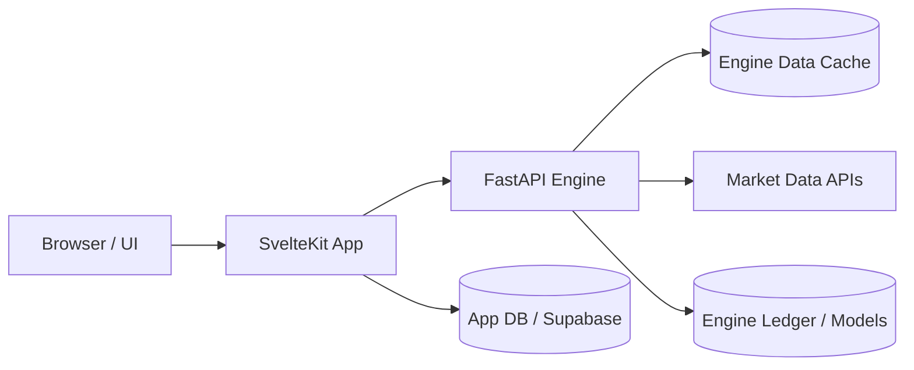
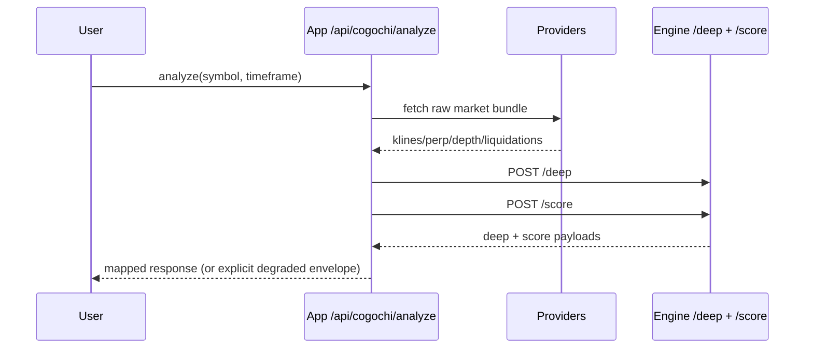

# System Architecture

This document defines the current high-level structure with ownership boundaries.

## Context Diagram

## Ownership Map

- `app/`: UI surface and orchestration only
- `engine/`: canonical decision logic and scoring
- `docs/`: product/domain/decision truth and runbooks
- `research/`: hypotheses, eval protocol, experiment records

## Analyze Hot Path

## Route Types

- proxy routes: pass-through only, no app-domain logic
- orchestrated routes: app assembles inputs and calls engine
- app-domain routes: engine not involved

## Reliability Notes

- degraded responses must set explicit degraded flags/reasons
- app never executes duplicated engine scoring logic
- contract updates must include both engine schema and app type sync
