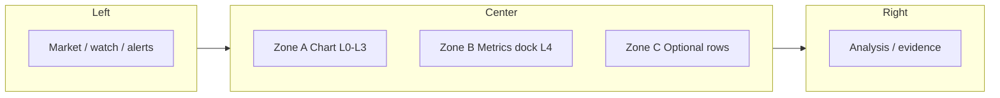

# W-0048 — Terminal chart architecture & layers (TV-grade data, platform overlays)

**Owner:** `app` (primary) · `contract` (API shapes) · `engine` (only if series truth moves server-side)  
**Primary change type:** Product surface + contract (design-first; implementation in phased PRs)

---

## 0. 설계 우선 (이 문서 → 그다음 코드)

**구현보다 먼저** 아래를 이 파일에 맞춰 고정한 뒤 PR을 연다.

1. **정보 구조(IA)**: 좌 / 중 / 우 역할 (§ Terminal IA).
2. **가운데 열 구역**: Zone A 차트 vs Zone B 수집 지표 독 vs Zone C 부가 행 (§ Center column zones).
3. **데이터 출처**: L1 차트 시계열 vs L4 집계 스냅샷 (§ Data sources).
4. **한 PR = 한 축**: IA / 계약 / UI 중 하나만.

급한 UI 뒤집기는 **해당 절 갱신 없이 하지 않는다.**

---

## Terminal IA — 좌 · 중 · 우

| 영역 | 역할 | 사용자 기대 |
|------|------|-------------|
| **좌** | 마켓 맥락, 워치·스캐너·알림 | 무엇을 볼지 고른다 |
| **중** | 실행 보드: **시간축(차트)** + **집계 지표(독)** | 지금 심볼을 읽고 판단한다 |
| **우** | 해석·근거·메모리·스캔 | 왜 그런지·다음 액션 |

**원칙:** 좌우는 맥락·해석, 가운데는 **시간축 + 숫자 요약**. 가운데에 장문 해석을 넣지 않는다.

### Narrow viewport (모바일·≤768px)

- **Zone A `ChartBoard`**는 `.desktop-board` 안에 있으며, **좁은 화면에서도 숨기지 않는다** (`/terminal/+page.svelte` 모바일 미디어쿼리: `center-board` `min-width: 0`, `board-content` 단일 컬럼, 세로 스크롤 허용). L1 차트·Save 시점 뷰포트 캡처가 소실되지 않게 하기 위함.
- **우측 분석 레일**은 해당 뷰포트에서 숨겨지고, 요약·베릭트는 **`MobileActiveBoard` 등 모바일 스택**으로 보조한다. 상세 IA는 `docs/product/pages/02-terminal.md` Layout Contract (Mobile)와 병행해 본다.

---

## Center column zones — 가운데 세 구역

| Zone | 이름 | 담는 것 | Layer |
|------|------|---------|--------|
| **A** | Chart hero | 캔들 + VOL / RSI·MACD / OIΔ / CVD 등 **동일 시간축** 서브패널 | L0–L3 |
| **B** | Collected metrics dock | 바이낸스·`/api/chart/klines` **최신 막대 요약** + 분석 스냅·보드모델 **집계**를 가로 한 데 | **L4** |
| **C** | Progressive rows | 패턴 바, Evidence, 오더북·유동성 카드 등 (토글·접기) | L4 UI |

**“TV/바이낸스급 차트”** = Zone A의 시계열·캐시·MTF 정렬.  
**“우리가 모은 지표를 실제로 본다”** = Zone B에 **표 형태로 고정**(차트 Y축과 혼동 방지; 오버레이는 명시 토글일 때만 Zone A).

---

## Data sources — 무엇이 L1 vs L4인가

| 출처 | 대표 API / 데이터 | 성격 |
|------|-------------------|------|
| **거래소 OHLCV** | Binance FAPI `klines` (서버 경유 `/api/chart/klines`) | L1; 차트 진실 |
| **차트용 파생** | 동 응답 `indicators` (SMA, EMA, RSI, MACD, …), `emaTf` 시 MTF 정렬 | L1/L2 |
| **엔진 분석·스코어** | `GET /api/cogochi/analyze` → (앱이 Binance 등 수집 후) Python 엔진 `POST /deep` + `POST /score` 병렬 | L4 원천 중 하나; 베릭트·레이어·피처는 엔진 |
| **집계·해석** | `activeAnalysisData` / `buildTerminalBoardModel` (OI·펀딩·CVD 상태 등) | L4; Zone B·우측 |
| **실시간 보조** | depth / liq 경로 | L4; Zone C 또는 우측 |

**`AGENTS.md`와의 정렬:** 백엔드 진실은 `engine/`이지만, **차트용 L1 시계열 지표**는 현재 **`app/src/routes/api/chart/klines/+server.ts`에서 계산**한다. 분석 파이프라인(`/cogochi/analyze`)은 엔진 호출을 유지한다. “한 진실”을 엄격히 하려면 별도 수렴(계약·골든 테스트 또는 API 이전)이 필요하다 — Open Questions 참고.

---

## Boundary model — 지금 구조를 어떻게 다시 묶을 것인가

현재 코드는 “수치 계산”이 한 곳에만 있지 않다. 이를 숨기지 말고 아래처럼 **역할별로 이름을 고정**한다.

| Layer | 현재 소유 | 책임 | 금지 |
|------|-----------|------|------|
| **Chart kernel** | `app/src/routes/api/chart/klines/+server.ts` | OHLCV, OI/funding bars, chart indicators, MTF align input | panel/card 의미 추론, watchlist/pin/alert persistence |
| **Decision kernel** | `engine/` + `app/src/lib/server/analyze/orchestrator.ts` | `deep`/`score`, verdict, layer scores, engine-owned snapshots | chart-only presentation density 조정 |
| **Terminal aggregate** | `app/src/lib/server/*` + app-domain routes | chart + analyze + persistence + macro를 `/terminal`용으로 조립 | raw indicator 재계산, 엔진 로직 복제 |
| **Presentation / control** | `/terminal/+page.svelte` + workspace components | 렌더링, selection, local layout state, explicit user action dispatch | route-to-route fetch orchestration, business metric 정의 |

핵심은 **“engine vs app” 2분할만으로는 부족하고, app 안에서도 `kernel / aggregate / presentation`를 분리해야 한다**는 점이다.

## Metric ownership — 이름이 섞이지 않게 하는 방법

같은 `RSI`, `flow`, `funding` 이라는 단어가 다른 레이어에서 다른 의미로 쓰이지 않게 **metric namespace**를 고정한다.

| Namespace | 예시 | 소유 |
|-----------|------|------|
| `chart.*` | `chart.rsi14`, `chart.macd.hist`, `chart.ema21_mtf` | `klines` chart kernel |
| `snapshot.*` | `snapshot.funding_rate`, `snapshot.oi_change_1h` | analyze input / snapshot bundle |
| `deep.*` | `deep.total_score`, `deep.layers.cvd.score` | engine decision kernel |
| `board.*` | `board.flowState`, `board.regimeLabel` | terminal aggregate / UI-ready summary |

**규칙:** 사용자-facing 문구는 자유롭게 바꿔도 되지만, 저장·필터·NL 질의·실험은 반드시 위 같은 **stable metric ID**만 참조한다.

## Contract rules — 바로 깨지기 쉬운 경계

1. **app route → app route 호출 금지**
   현재 `watchlist`가 `/api/cogochi/analyze`를 다시 fetch해 preview를 enrich하는 패턴은 임시 상태다. 장기적으로는 `analysisAdapter.ts` 같은 **공유 서버 모듈**을 직접 import해야 한다.
2. **Svelte component에서 business metric 계산 금지**
   `02-terminal.md`의 Non-Goals를 그대로 따른다. 컴포넌트는 shape transform과 rendering만 담당한다.
3. **`/terminal/+page.svelte`는 composition boundary까지만**
   hydration 시작, action dispatch, selection state까지는 허용하되, durable action semantics와 route fan-out은 controller/service로 뺀다.
4. **Chart kernel과 decision kernel의 동일 이름 수치는 명시적으로 다르게 부른다**
   예: chart RSI와 engine feature RSI가 둘 다 필요하면 `chart.rsi14` vs `deep.feature.rsi14`처럼 분리한다.

## Target extraction — 다음 PR이 가야 할 모양

### P0. 문서/계약

- `W-0048`에서 Zone A/B/C와 `chart.*` vs `deep.*` 네임스페이스를 고정
- `docs/domains/terminal-backend-mapping.md`에 chart/board/deep 필드 출처 태그 추가

### P1. Server extraction

- `app/src/lib/server/chart/chartSeriesService.ts`
  - 현재 `klines/+server.ts`의 계산 로직을 route 밖으로 이동
- `app/src/lib/server/analyze/analysisAdapter.ts`
  - app 내부에서 analyze 재사용 시 route fetch 대신 직접 사용
- `app/src/lib/server/terminal/sessionService.ts`
  - `/terminal`이 필요한 persistence + restore 조립을 한곳에서 담당

### P2. Client extraction

- `app/src/lib/terminal/terminalController.ts`
  - pin / alert / compare / export / save-setup action orchestration
- `+page.svelte`
  - 여러 fetch와 durable-action 정책을 직접 들고 있지 않고 controller/session API만 호출

### P3. Conformance

- chart kernel vs engine kernel 간 동일 이름 메트릭이 생기면 golden test 추가
- 최소 비교 대상:
  - RSI
  - EMA
  - funding snapshot naming
  - OI change naming

이 순서대로 가면 **현재 구조를 뒤엎지 않고도** “계산은 어디, 조립은 어디, 렌더링은 어디”를 단계적으로 맞출 수 있다.

---

## Goal

차트 영역을 **급진적 UI 실험**이 아니라, **명시된 층(layer)** 위에서만 진화시킨다.  
**데이터 정렬(TradingView급)** 은 한 축으로 고정하고, **다른 플랫폼에 흩어진 인사이트(OI·펀딩·CVD·유동성 등)** 는 **별도 오버레이/패널 레이어**로 유지해 “TV처럼 읽히되, 우리만의 시그널 레이어가 얹힌 구조”를 만든다.

## Scope

- 터미널 **좌·중·우 IA**와 **가운데 Zone A/B/C** 역할 (이 문서 상단 절 참조).
- 차트 도메인 **논리 모델**: 시간축, 바 단위, 지표 시리즈, MTF 정렬 규칙.
- **L1 vs L4 데이터 출처** 표 (§ Data sources).
- **Chart kernel / decision kernel / terminal aggregate / presentation** 경계 (§ Boundary model).
- **UI/UX 원칙**: Zone A(차트) vs Zone B(수집 지표 독) 분리; 변경 시 이 문서 갱신.
- **계약 경계**: `/api/chart/klines` 등 앱↔데이터 소스 경계와 payload 필드 의미.
- **metric namespace 규칙**: `chart.*`, `snapshot.*`, `deep.*`, `board.*`.
- **차별화 레이어**: CQ/델타 스타일 파생, 터미널 전용 스트립 — L4로 명시.

## Non-Goals

- 단일 PR에서 “트레이딩뷰 전체 인디케이터 카탈로그” 재현.
- `app/`에 엔진급 진실(백테스트·리스크 엔진) 이식.
- 레거시 PRD 길이의 문서화; 이 아이템은 **판단·경계**만 고정한다.

## Canonical files (read before chart PRs)

- `app/src/routes/terminal/+page.svelte` — **중앙 열 IA** (chart-area 안 순서: ChartBoard → Zone B → Zone C); **`chartFocusMode`**, 모바일/데스크톱 레이아웃 CSS.
- `app/src/components/terminal/workspace/CollectedMetricsDock.svelte` — Zone B (L1 스냅 + L4 보드).
- `app/src/lib/terminal/collectedMetrics.ts` — 독에 올릴 셀 빌드 (중복 방지 단일 진입).
- `app/src/components/terminal/workspace/ChartBoard.svelte` — Zone A만 (L3 표현).
- `app/src/components/terminal/workspace/TerminalContextPanel.svelte` — 우측 해석 레일; chart lane에서는 L4 설명 보강만 허용.
- `app/src/components/terminal/workspace/StructureExplainViz.svelte` — structure explanation 시각화.
- `app/src/routes/api/chart/klines/+server.ts` — 캔들·파생 시리즈·캐시 키.
- `app/src/lib/server/analyze/orchestrator.ts` — 엔진 `/deep`·`/score` 병렬 호출 (L4와의 경계 이해용).
- `app/src/lib/chart/mtfAlign.ts` — HTF→LTF 정렬 규칙.
- `app/src/lib/terminal/structureExplain.ts` — deep-analysis 설명 모델.
- `app/src/lib/api/terminalBackend.ts` — `ChartSeriesPayload` 등 번들/차트 타입.
- `app/src/lib/terminal/terminalBoardModel.ts` — L4 집계 일부 (`buildTerminalBoardModel`).
- `app/src/lib/terminal/panelAdapter.ts` — 분석 페이로드 → 패널/에셋/근거 UI 모델 (`terminal-backend-mapping.md`와 함께).
- `docs/domains/terminal-backend-mapping.md` — UI 블록 ↔ API 필드 맵.
- 필요 시 `docs/product/core-loop-system-spec.md` — 터미널 루프와 정합.
- **뷰포트 캡처·패턴 저장 계약** (`SaveSetupModal.svelte`, `chartViewportCapture.ts`, `terminalPersistence.ts` 확장)은 **W-0051**이 소유; 차트 lane PR에는 섞지 않는다(D7).

## Architecture (layers)

| Layer | 역할 | TV 대비 | 우리 쪽 차별 |
|-------|------|---------|----------------|
| **L0 Time** | 심볼, 거래소/선물 여부, 바 `time` (open), `tf`, `limit` | 캔들 시간축 일치 | 동일 개념으로 고정 |
| **L1 Series** | OHLCV, SMA/EMA/RSI/MACD 등 **같은 tf 또는 명시된 tf** 위에서 계산된 시리즈 | 스터디 정의 | 계산 규칙은 서버에 문서화·버전 가능 |
| **L2 Align** | 상위 tf 지표를 하위 차트 바에 **forward-step** (`mtfAlign`) | MTF EMA 등 | 정렬 함수 단일 진실 |
| **L3 Present** | lightweight-charts: 메인·볼륨·오실레이터·OI/CVD 패널 | 레이아웃 유사 | 패널 수·순서는 제품 정책으로 제어 |
| **L4 Terminal** | 펀딩·CVD 누적·유동성·퀀트 스트립 등 **읽기 전용 컨텍스트** | TV 단일 앱에 없는 조합이 많음 | **TV 코어와 시각적으로 분리**(오버레이/접기/별 패널) |

**원칙:** L1–L2는 “차트가 거짓말하지 않게”; L4는 “해석을 돕는 추가 레이어”로 섞지 않는다(단위·축 혼동 방지).

## UX / UI 원칙 (급진 변경 방지)

1. **한 번에 하나의 축**: 데이터 계약 변경 / 스터디 레지스트리 / 툴바 IA 중 **한 PR에 하나**를 우선한다.
2. **스터디 추가 = 명시적 진입점** (예: Indicators 패널) — 단, 배치·카피·밀도 변경은 **스크린 목표**(정보 계층)를 먼저 이 문서에 한 줄로 적고 나서 한다.
3. **TV급 정렬**은 UI가 아니라 **L1+L2+캐시 키**로 증명한다(같은 요청 → 같은 시퀀스).
4. **플랫폼 전용 기능**은 “기본 차트를 가리지 않는다” — 접기, 별도 스트립, 오른쪽 레일 우선.

## Facts

1. 캔들·다수 지표는 `klines` API에서 생성되며 캐시 키에 `symbol`, `tf`, `limit`, `emaTf` 등이 포함된다.
2. HTF 지표는 `alignHtfSeriesToLtfTimes`로 LTF `time`에 맞춘다.
3. `ChartBoard`는 표현·동기화(리사이즈·타임스케일) 책임이 크고, 장기적으로 “스터디 레지스트리”로 분리 여지가 있다.
4. 터미널은 분석·메모리·패턴과 같은 **다른 루프**와 같은 화면에 공존하므로 차트는 **한 뷰포트 안에서 과밀**해지기 쉽다.
5. **Zone B**는 `CollectedMetricsDock` + `buildCollectedMetricCells` (`app/src/lib/terminal/collectedMetrics.ts`)로 **차트 헤더와 중복되지 않게** RSI·펀딩·OI·MACD·레짐·플로우를 한 줄에 모은다; 차트 헤더는 **Last / 24h / 1 bar**만 유지한다.
6. 현재 dirty 구현은 `ChartBoard.svelte`, `CollectedMetricsDock.svelte`, `collectedMetrics.ts`, `mtfAlign.ts`, `klines/+server.ts`, `terminalBoardModel.ts`, `TerminalContextPanel.svelte`, `StructureExplainViz.svelte`, `/terminal/+page.svelte`의 chart-focus UI를 함께 건드리고 있다.
7. 같은 dirty 구현 안에 `SaveSetupModal.svelte`, `terminalPersistence.ts`, `chartViewportCapture.ts`가 섞여 있지만, 그 부분은 **W-0051 capture contract lane**에 속한다.
8. `W-0036` terminal persistence 기준선은 이미 `origin/main`에 머지됐으므로, chart lane은 persistence rollout의 후속으로 merge되면 안 된다.
9. **모바일(≤768px)** 에서도 `ChartBoard`가 보이도록 레이아웃이 조정됨: `.desktop-board`를 숨기지 않고, `center-board`/`board-content`가 좁은 폭에서 깨지지 않게 함; 우측 레일은 숨기고 `mobile-board-wrap`이 병행된다.
10. **L4 분석**은 `GET /api/cogochi/analyze`가 엔진 `deep`/`score`와 연결되며, **L1 차트 지표**는 동일 요청 축이 아닌 **`/api/chart/klines`** 에서 별도 제공된다 — 두 경로를 문서·계약에서 혼동하지 말 것.
11. 현재 `/terminal` app 영역에는 route-to-route coupling이 남아 있다. 예를 들어 watchlist preview enrich는 app route 안에서 `/api/cogochi/analyze`를 다시 fetch하는 패턴을 사용한다.
12. `panelAdapter.ts`는 이미 `terminal-backend-mapping.md`를 authority로 선언하고 있으므로, chart/deep/board metric namespace도 같은 문서 계열에서 고정하는 편이 자연스럽다.

## Assumptions

1. 단기간 내 차트 엔진 교체(TradingView 위젯 등)는 비용 대비 이득이 불명확하다.
2. 사용자는 “TV에서 익숙한 읽기”와 “연구/실행 OS에서만 쓰는 레이어”를 **동시에** 원한다.

## Open Questions

1. 지표 계산을 **완전 서버 고정**할지, 일부는 **클라이언트 재계산** 허용할지(재현성 vs 유연성).
2. **`/api/chart/klines` L1 지표**와 **엔진 피처/스코어**에 **동일 이름의 수치**가 생길 때 정합을 어떻게 증명할지(골든 테스트, 단일 소스, 또는 명시적 “차트 전용” 네임스페이스).
3. 스터디 목록을 **정적 설정 파일**으로 뺄 시점(버전, 실험 플래그).
4. L4 스트립을 **항상 접힘 기본**으로 둘지, 사용자·워크스페이스에 저장할지.
5. chart kernel을 engine으로 이동할지, 아니면 app server의 저지연 전용 kernel로 남기되 conformance test만 강제할지.

## Decisions (revisit when superseded)

- **D1:** MTF 정렬은 `mtfAlign`만 사용; 같은 규칙을 다른 HTF 시리즈에도 재사용한다.
- **D2:** “TV급”은 **시간축·스텝·캐시 일관성**으로 정의하고, 픽셀 완벽 복제는 목표에 넣지 않는다.
- **D3:** 급한 UI 뒤집기 대신, 변경 전 **이 워크 아이템의 Scope/Non-Goals**와 충돌 여부를 본다.
- **D4:** **Zone B (수집 지표 독)** 는 `ChartBoard`와 분리된 컴포넌트로 두어 L3 렌더와 L4 스냅샷 표시 책임을 섞지 않는다.
- **D5:** 좌·중·우 IA는 위 표를 따른다; 가운데에 “해석 카드”만 억지로 늘리지 않는다.
- **D6:** 이 lane의 clean branch에는 chart visualization / chart read-contract / right-rail explanation 보강만 포함한다.
- **D7:** viewport snapshot 저장, `Save Setup` capture payload, pattern capture contract 확장은 이 lane에서 다루지 않고 **W-0051**로 보낸다.
- **D8:** refinement control-plane, replication harness, ledger record, security runtime 파일은 모두 out-of-scope다.
- **D9:** chart metrics는 당장은 `app`의 chart kernel로 유지하되, 이름과 범위를 `chart.*` namespace로 고정해 engine decision metrics와 혼동하지 않는다.
- **D10:** `/terminal` page는 최종적으로 terminal aggregate + controller만 호출하는 방향으로 수렴한다; app route 내부 route fetch는 과도기 패턴으로 본다.

## Next Steps

1. clean branch `codex/w-0048-terminal-chart-architecture-design`를 `origin/main`에서 분기한다.
2. 첫 merge unit은 `ChartBoard.svelte` + `CollectedMetricsDock.svelte` + `collectedMetrics.ts` + `klines/+server.ts` + `mtfAlign.ts` + `/terminal/+page.svelte` chart-area 배치만으로 제한한다.
3. `TerminalContextPanel.svelte` + `StructureExplainViz.svelte`는 두 번째 merge unit로 분리할지, 첫 unit에 넣어도 되는지 diff 폭을 보고 판단한다.
4. `SaveSetupModal.svelte`, `terminalPersistence.ts`, `chartViewportCapture.ts`는 branch에서 제외하고 W-0051 branch로 넘긴다.
5. chart 관련 PR마다 **이 파일의 Layers 또는 IA 표를 한 줄 갱신**한다.
6. 다음 설계 PR에서 `chartSeriesService.ts` / `analysisAdapter.ts` / `terminalController.ts` 추출 여부를 먼저 판단하고, route-to-route coupling 제거를 chart lane 후속 과제로 등록한다.

## Phased delivery (권장 순서)

| 단계 | 산출물 | 코드 |
|------|--------|------|
| P0 | 이 문서 + Zone B 필드 표 | 없음 |
| P1 | `CollectedMetricsDock.svelte` 목업(정적 칩) | 최소 |
| P2 | `activeChartPayload` + `boardModel` → 독에 바인딩 | 중앙열만 |
| P3 | 접기·반응형·워크스페이스 기억 | 선택 |

## Exit Criteria

- 새 기여자가 “차트 데이터가 어디서 오고 MTF는 어떻게 맞는가”를 **이 문서 + mtfAlign + klines**만으로 답할 수 있다.
- 제품이 “TV 같은 차트 + 타 플랫폼 시그널”을 **레이어로 설명**할 수 있다.

## Handoff Checklist

- [ ] 브랜치/PR이 이 워크 아이템의 **owner·change type**과 맞는가?
- [ ] UI 변경이면 **L3 vs L4** 중 어디인지 명시했는가?
- [ ] 캐시/정렬/시간축을 바꿨으면 **검증 방법**(동일 요청 비교 등)을 적었는가?
- [x] clean design lane created:
  - branch: `codex/w-0048-terminal-chart-architecture-design`
  - worktree: `/tmp/wtd-v2-w0048-chart-design`
  - doc-only seed commit: `1e9e8eb`
- [x] merged baseline already on `main` before this lane starts:
  - `#52` analyze contract consumer merged
  - `#53` save-setup capture link merged
  - `#55` terminal page integration merged
  - `#56` optional pattern seed scout lane merged
- [x] do not re-open `W-0036` for chart lane work; continue from this work item + clean branch only
